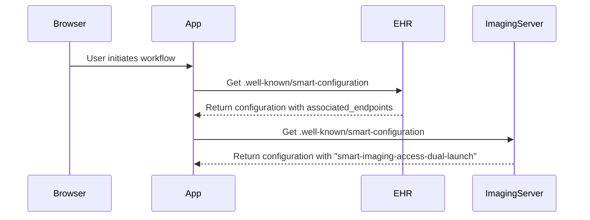
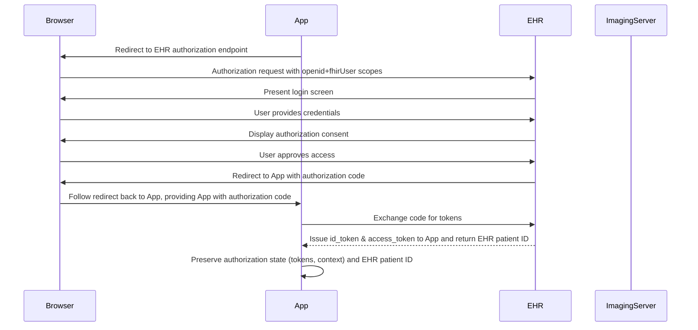
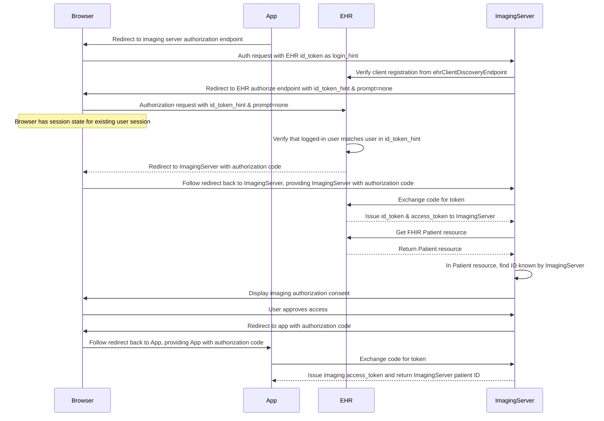
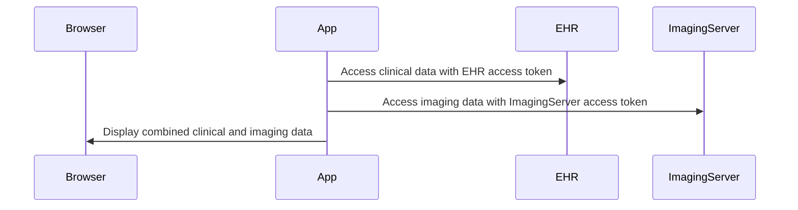

The section enables applications to obtain authorization from multiple systems while maintaining appropriate user consent and security controls. It builds on existing SMART App Launch flows, executing them sequentially with contextual information passed between authorization requests.

# Dual SMART Launch Specification

## Introduction

Dual SMART Launch enables an application to obtain authorization from multiple systems (specifically an EHR and an Imaging Server) while maintaining appropriate user consent and security controls. It builds on existing SMART App Launch flows, executing them sequentially with contextual information passed between authorization requests.

## Goals

- Preserve the security properties of SMART App Launch
- Maintain distinct authorization grants for each system
- Enable automated authentication when supported
- Preserve patient context across authorization requests
- Require no protocol extensions beyond standard SMART, OAuth 2.0, and OpenID Connect parameters
- Simplify user experience by reducing redundant authentication steps

## Core Components

1. **Initial Authorization**: The application obtains authorization from the EHR system using standard SMART App Launch
2. **Context Preservation**: EHR-supplied context (patient ID, user identity) is preserved for subsequent authorization
3. **Secondary Authorization**: The application initiates authorization with imaging system using preserved context
4. **Token Issuance**: Each system issues distinct access tokens for their respective resources
5. **Identifier Management**: Systems coordinate different patient identifiers across EHR and imaging contexts

## Technical Flow

### Phase 1: Endpoint Discovery



#### Narrative Explanation

When the application begins the Dual SMART Launch process, it first needs to discover where the related systems are located and whether they support this capability. The application starts by querying the EHR's well-known SMART configuration endpoint to obtain metadata about the EHR's capabilities. 

The EHR's response includes an `associated_endpoints` array that lists related systems such as imaging servers. Each entry in this array includes a URL and a list of capabilities supported by that endpoint. The application looks for endpoints that include the "smart-imaging-access-dual-launch" capability.

After identifying a compatible imaging server from the EHR's configuration, the application directly queries that imaging server's SMART configuration to verify it explicitly supports dual launch. This two-step discovery process ensures both systems are properly configured to support the dual authorization workflow before proceeding.

It's important to note that at this stage, the application is simply discovering endpoints. It doesn't yet know about any patient identifiers in either system. These identifiers, which may differ between systems, will be received later in the authorization process.

#### Developer Details

1. The Application retrieves the EHR's SMART configuration from `[ehrFhirBaseUrl]/.well-known/smart-configuration`.
2. The imaging server URL `[imagingServerFhirBaseUrl]` is discovered through the `associated_endpoints` array.
3. Servers that want to advertise associated endpoints supporting Dual SMART Launch will include the "smart-imaging-access-dual-launch" capability in the associated endpoint's capabilities array:

```json
{
  "capabilities": [...],
  "associated_endpoints": [{
    "url": "[imagingServerFhirBaseUrl]",
    "capabilities": ["smart-imaging-access-dual-launch"]
  }]
}
```

4. The application retrieves the SMART configuration from `[imagingServerFhirBaseUrl]/.well-known/smart-configuration`.
5. The imaging server's configuration MUST include "smart-imaging-access-dual-launch" in its capabilities array to indicate support for receiving an OpenID Connect `id_token` as a `login_hint`.

### Phase 2: App to EHR Authorization



#### Narrative Explanation

After discovering the endpoints, the application initiates a standard SMART App Launch flow with the EHR. This is a crucial first step because the application needs to establish the user's identity and clinical context before accessing imaging data.

The application initiates this process by directing the user to the EHR's authorization endpoint, including special scopes like `openid` and `fhirUser` in addition to any clinical data scopes it needs. These specific scopes tell the EHR that the application will need an OpenID Connect identity token (`id_token`) in addition to the standard access token.

The user then authenticates with the EHR using their credentials and is presented with an authorization screen showing what data the application is requesting. After the user approves, the EHR returns an authorization code to the application.

The application exchanges this code for tokens by making a request to the EHR's token endpoint. The EHR responds with an access token for clinical data and the requested OpenID `id_token`, which contains claims about the user's identity. In addition, the token response includes a `patient` property containing the FHIR logical id of the patient in the EHR's FHIR server. This logical id is the unique identifier that appears in resource URL path components (e.g., `/Patient/123` where "123" is the logical id). The application stores these tokens and the current context for use in the subsequent imaging server authorization.

It's important to understand that this FHIR logical id is specific to the EHR's FHIR server. The same patient may have a different logical id in the imaging FHIR server, though the application doesn't know about the imaging server's identifier yet.

This phase follows standard SMART App Launch, but the request for OpenID scopes is particularly important for the dual launch process, as the `id_token` will be used to facilitate the connection to the imaging server.

#### Developer Details

1. The application initiates a SMART App Launch flow with the EHR, requesting authorization including the `openid` and `fhirUser` scopes to ensure receipt of an OpenID Connect `id_token`.
2. The user authenticates with the EHR (e.g., username/password, MFA).
3. The EHR displays an authorization request for clinical data scopes.
4. The user approves and grants access.
5. The application exchanges its authorization code for an Access Token Response that includes:
   - An access token for accessing EHR resources
   - An OpenID Connect `id_token` as requested via the scopes
6. Before initiating authorization with the imaging server, the application preserves its current authorization state, including:
   - The EHR's access token
   - The EHR's OpenID Connect `id_token` 
   - Current application state and context

### Phase 3: App to Imaging Server Authorization



#### Narrative Explanation

This phase represents the most innovative part of the Dual SMART Launch flow. Having obtained authorization from the EHR, the application now initiates a second SMART App Launch with the imaging server. However, unlike a standard launch, the application includes the EHR-issued `id_token` as a `login_hint` parameter in its request to the imaging server.

When the imaging server receives this request, it kicks off an embedded workflow that's largely invisible to the user:

First, the imaging server needs to verify that the application is legitimate. It does this by contacting the EHR's client discovery endpoint to retrieve information about the application's registration. This allows the imaging server to validate the application's redirect URI and, for confidential clients, obtain the keys needed to verify signatures.

Next, the imaging server initiates its own authorization request back to the EHR. Here's where the magic happens: it includes the original `id_token` as an `id_token_hint` and sets `prompt=none`, essentially telling the EHR "this user has already authenticated, so don't show them another login screen." If the token is valid, the EHR automatically issues tokens to the imaging server without any user interaction. These tokens grant the imaging server permission to access relevant patient data from the EHR.

An important aspect of this token exchange is that the EHR includes a `patient` property in its access token response. This property contains the FHIR logical id of the patient in the EHR's FHIR server. The FHIR logical id is the specific identifier that appears in resource URL path components (e.g., `/Patient/123` where "123" is the logical id). The imaging server can use this EHR-supplied patient logical id to establish context for subsequent operations.

With these tokens in hand, the imaging server can now implement its authorization policy. It has two main options:
1. It could use the EHR-issued token to query the EHR's FHIR API for available imaging studies, relying on the EHR's access controls
2. Or it could apply its own access policies based on the user and patient context it received

For patient identity correlation, the imaging server can retrieve the full Patient resource from the EHR using the EHR-issued access token and the patient's logical id. This allows the imaging server to access the array of FHIR Identifiers (distinct from the logical id) stored in the Patient resource. These identifiers, which may include MRNs, national IDs, or other identifier systems, can then be used by the imaging server to map to its own internal patient representation, which likely has its own FHIR logical id in the imaging system.

Finally, the imaging server presents an authorization screen to the user, asking for permission to share imaging data with the application. After approval, the imaging server issues an authorization code to the application, which is exchanged for an access token specific to imaging resources. The imaging server includes its own `patient` property in the token response, containing the imaging system's FHIR logical id for the patient, which may be different from the EHR's logical id.

This phase elegantly solves the problem of requiring multiple authentications while still maintaining separate, explicit authorization decisions for different data types and managing potentially different patient identifiers across systems.

#### Developer Details

1. **Application Authorization Request**:
   - The application initiates a SMART on FHIR standalone launch request to the imaging server's authorize endpoint.
   - This request includes the OpenID Connect `id_token` (from the EHR) in the `login_hint` parameter.
   - Required scopes for imaging access are included.

2. **Imaging Server Client Verification**:
   - The imaging server MUST verify the requesting client's credentials by retrieving the client's registration details from the EHR's client discovery endpoint.
   - The imaging server retrieves client metadata from `[ehrClientDiscoveryEndpoint]/clients/[clientId]`.
   - The imaging server validates the client type and authentication method:
     * For public clients: validates only the `redirect_uri`
     * For confidential clients using asymmetric authentication: retrieves the JWKS or JWKS URI for validating signatures during the token exchange
     * All other client types MUST be rejected

3. **Embedded EHR Authentication** (No User-visible Steps):
   - The imaging server initiates an authorization request to the EHR's authorization endpoint with:
     * The EHR's OpenID Connect `id_token` passed in the `id_token_hint` parameter
     * `prompt=none` to request automated authentication
     * Scopes requesting access to relevant patient and imaging study data
   - The EHR processes this request and, if valid:
     * Validates the `id_token_hint`
     * Automatically issues a new Access Token Response containing:
       + An access token for the imaging server to access relevant FHIR resources
       + A new OpenID Connect `id_token`
       + The current patient context

4. **Authorization Policy Implementation**:
   - The imaging server has multiple options for implementing its authorization policy:
     * **Independent Policy**: The imaging server can implement its own access policy based on the patient and user context received from the EHR
     * **EHR-Integrated Policy**: If the EHR hosts ImagingStudy FHIR resources, the imaging server can gate access based on which studies are visible using the EHR-provided access token. This allows for shared enforcement of access rules between the systems.

5. **User Authorization**:
   - The imaging server MUST present an authorization screen to the user asking if they want to authorize the supplied client to access imaging data.
   - This divides authorization decision-making between:
     * The EHR (for clinical access authorization)
     * The imaging server (for imaging access authorization)

6. **Token Exchange**:
   - After user approval, the application exchanges its authorization code for an Access Token Response from the imaging server.
   - This token grants access specifically to the approved imaging resources.

### Phase 4: Resource Access



#### Narrative Explanation

Once the application has successfully completed authorization with both systems, it now possesses two distinct access tokens: one for the EHR and one for the imaging server. The final phase involves using these tokens to access the respective resources.

The application can now make API calls to both systems in parallel or sequentially as needed. When requesting clinical data, it includes the EHR-issued access token in its requests to the EHR's FHIR API. Similarly, when requesting imaging data, it includes the imaging server-issued access token in its requests to the imaging server's API.

When accessing Patient resources, the application must be aware that it has received different FHIR logical ids for the same patient:
1. The EHR's patient logical id (from the EHR token response)
2. The imaging server's patient logical id (from the imaging server token response)

These logical ids are used differently when making requests to their respective systems:
- `GET [ehrFhirBaseUrl]/Patient/{ehrPatientLogicalId}` (using EHR token)
- `GET [imagingServerFhirBaseUrl]/ImagingStudy?patient={imagingPatientLogicalId}` (using imaging server token)

Note that the imaging server may not expose Patient resources directly, but instead uses the patient parameter in queries for ImagingStudy resources.

The application doesn't need to perform any patient identifier mapping itself; that responsibility was handled by the imaging server during the authorization phase. The application simply uses each system's native patient logical id when making requests to that system.

Additionally, if the application needs to access a patient's full identifier set (beyond just the logical id), it can retrieve the Patient resource from the EHR and examine the `identifier` array, which contains all the business identifiers (like MRNs, national IDs, etc.) associated with the patient.

This separation of tokens and identifiers maintains the principle of least privilege. Each system issues tokens that grant access only to the resources under its control, and each system independently validates and enforces the appropriate access controls when receiving requests. If a token for one system is compromised, it cannot be used to access resources from the other system.

The application can now provide an integrated view of both clinical and imaging data to the user, having navigated the dual authorization process in a way that balances security with a streamlined user experience.

#### Developer Details

1. The client application can now access:
   - EHR resources using the EHR-issued access token
   - Imaging resources using the imaging server-issued access token
2. Each system maintains independent access control and token validation.

## Implementation Requirements

### EHR Requirements

1. **SMART Configuration**:
   - Must expose a SMART configuration at `.well-known/smart-configuration`
   - Must include associated imaging endpoints in the `associated_endpoints` array
   - Must include appropriate capabilities in the associated endpoint's capabilities array

2. **OpenID Support**:
   - Must support OpenID Connect to issue id_tokens
   - Must support the `openid` and `fhirUser` scopes

3. **Client Registry API**:
   - Must expose a `/clients/{client_id}` endpoint that returns client metadata
   - Should restrict exposed client registration data to clients using authorization code flow only
   - May omit the client's registered scope list

4. **Automated Authentication Support**:
   - Must support `id_token_hint` and `prompt=none` parameters
   - Must be able to authenticate users automatically based on the provided id_token

5. **Patient Context**:
   - Must include the patient's FHIR logical id in the `patient` property of token responses
   - Must support access to Patient resources with their full set of identifiers

### Imaging Server Requirements

1. **SMART Configuration**:
   - Must expose a SMART configuration at `.well-known/smart-configuration`
   - Must include "smart-imaging-access-dual-launch" in capabilities array

2. **EHR Integration**:
   - Must be able to retrieve client metadata from the EHR
   - Must be able to initiate an authorization request to the EHR
   - Must implement authorization policies based on EHR-provided context

3. **User Authorization**:
   - Must present explicit authorization screens for user consent
   - Must issue and validate tokens for resource access

4. **Patient Identity Correlation**:
   - Must be able to map between EHR-supplied patient identifiers and internal patient identifiers
   - May use the EHR's FHIR Patient resource to access the full set of business identifiers
   - Must include its own patient logical id in token responses to the application

### Client Application Requirements

1. **Discovery**:
   - Must be able to discover imaging endpoints from EHR configuration
   - Must verify dual launch capability support

2. **Authorization Management**:
   - Must request appropriate scopes including `openid` and `fhirUser`
   - Must preserve EHR authorization state before initiating imaging authorization
   - Must manage separate tokens for EHR and imaging resources

3. **Resource Access**:
   - Must use the appropriate patient logical id for each system when making requests

## Security Considerations

1. **Token Isolation**:
   - Access tokens for each system remain distinct
   - Compromise of one token does not affect the other system

2. **User Authorization**:
   - User explicitly approves both EHR and imaging data access
   - Automated steps only occur with valid id_tokens and existing sessions

3. **Client Authentication**:
   - Only public clients and asymmetric-authenticated confidential clients are eligible
   - Client credentials and symmetric authentication methods are not supported

4. **Representative Scenarios**:
   - When a user acts as a designated representative (e.g., parent for child)
   - EHR communicates this context via `id_token` (acting user) and `patient` claims (subject)
   - Imaging server enforces appropriate access based on the relationship

5. **Identifier Protection**:
   - Patient identifiers should be treated as sensitive information
   - The logical id mapping between systems should not be exposed to end users
   - Systems should validate that requests only access resources for the authorized patient

## Patient Identifier Management

### FHIR Logical IDs vs. FHIR Identifiers

In the Dual SMART Launch flow, it's essential to understand the distinction between different types of identifiers:

1. **FHIR Logical ID**: This is the unique identifier for a resource within a specific FHIR server.
   - It appears in resource URL path components (e.g., `/Patient/A123` where "A123" is the logical id)
   - Each system (EHR and Imaging Server) has its own logical ids
   - The EHR's logical id for a patient may differ from the Imaging Server's logical id for the same patient
   - Logical ids are included in token responses via the `patient` property

2. **FHIR Identifiers**: These are the array of business identifiers stored in the `identifier` property of a resource.
   - They represent real-world identifiers like MRNs, national IDs, or other identifier systems
   - They are stored as an array of objects, each with a system and value
   - These identifiers often bridge across different healthcare systems

### Identifier Correlation Process

The Imaging Server is responsible for correlating patient identifiers between systems:

1. The Imaging Server receives the EHR's patient logical id in the token response from the EHR
2. It can then access the Patient resource from the EHR using this logical id
3. From the Patient resource, it can extract the FHIR Identifiers (e.g., MRNs, facility identifiers)
4. The Imaging Server uses these identifiers to locate the corresponding patient in its own system
5. It then issues its own access token with its own patient logical id to the application

This correlation can be implemented in several ways:

- **Direct Mapping**: If both systems use the same enterprise MRN or national identifier
- **Identifier Translation Table**: A mapping table between identifier systems
- **Master Patient Index**: Using a central authority for patient identity correlation
- **On-Demand Resolution**: Resolving identifiers at the time of the request

The application is shielded from this complexity and simply uses each system's patient logical id in its requests.
